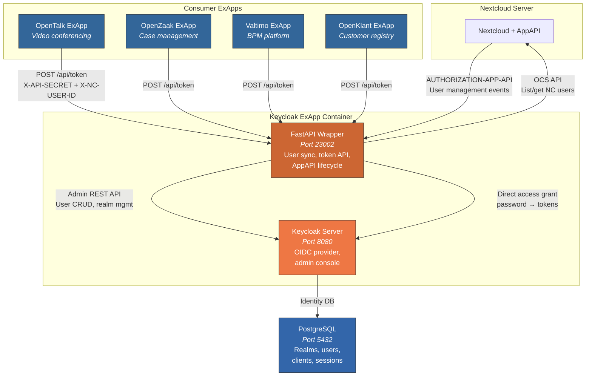
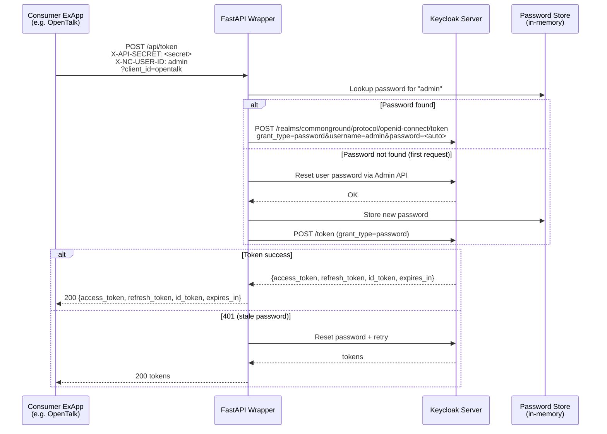

<p align="center">
  
</p>

<h1 align="center">Keycloak Nextcloud ExApp</h1>

<p align="center">
  <strong>Keycloak identity and access management as a Nextcloud External Application -- shared OIDC provider for Common Ground ExApps</strong>
</p>

<p align="center">
  <a href="https://github.com/ConductionNL/keycloak-nextcloud/releases"></a>
  <a href="https://github.com/ConductionNL/keycloak-nextcloud/blob/main/LICENSE"></a>
</p>

---

## Overview

This ExApp wraps [Keycloak](https://www.keycloak.org/) as a Nextcloud sidecar, providing a centralized OIDC identity provider for all Common Ground ExApps. It automatically syncs Nextcloud users to Keycloak and provides a token API for server-side authentication, enabling seamless SSO without browser-side OIDC redirects.

### Key Features

- **Automatic user sync** -- Nextcloud users are synced to Keycloak on startup, on-demand, and on user changes
- **Token API** -- Consumer ExApps (OpenTalk, OpenZaak, Valtimo) request Keycloak tokens server-side via a shared secret
- **Realm management** -- Auto-creates the `commonground` realm and configures OIDC clients
- **Direct access grant** -- Gets tokens for users without browser interaction
- **Admin console** -- Keycloak admin UI accessible from Nextcloud top menu

### Consumer ExApps

The Keycloak ExApp serves as the shared identity provider for:

| ExApp | Usage |
|-------|-------|
| [OpenTalk](https://github.com/ConductionNL/opentalk) | Video conferencing SSO -- iframe-embedded with pre-loaded tokens |
| [OpenZaak](https://github.com/ConductionNL/openzaak) | ZGW case management authentication |
| [Valtimo](https://github.com/ConductionNL/valtimo) | BPM and case management SSO |
| [OpenKlant](https://github.com/ConductionNL/openklant) | Customer interaction registry auth |

## Requirements

| Dependency | Version | Notes |
|-----------|---------|-------|
| Nextcloud | 30+ | |
| [AppAPI](https://apps.nextcloud.com/apps/app_api) | latest | Must be installed and configured with a deploy daemon |
| Docker | -- | Required for ExApp container deployment |
| PostgreSQL | 14+ | Keycloak database backend |
| Java 21 | -- | Bundled in the Docker image |

## Quick Start

The ExApp is included in the OpenRegister docker-compose setup:

```bash
docker compose -f openregister/docker-compose.yml --profile commonground up -d
```

Default Keycloak admin credentials: `admin` / `admin`

## Configuration

| Variable | Description | Default |
|----------|-------------|---------|
| `KEYCLOAK_REALM` | Realm name for user sync and token issuance | `commonground` |
| `KC_BOOTSTRAP_ADMIN_USERNAME` | Keycloak admin username | `admin` |
| `KC_BOOTSTRAP_ADMIN_PASSWORD` | Keycloak admin password | `admin` |
| `KC_HOSTNAME` | Hostname in issued tokens (must match consumer expectations) | -- |
| `KEYCLOAK_API_SECRET` | Shared secret for ExApp-to-ExApp token API calls | `keycloak-exapp-internal-secret` |

## Architecture

### Component Overview

The Keycloak ExApp container bundles two processes and connects to a shared PostgreSQL database:

| Component | Image / Technology | Role | Port |
|-----------|-------------------|------|------|
| **FastAPI Wrapper** | Python / nc_py_api | AppAPI lifecycle, user sync, token API, Keycloak proxy | 23002 (ExApp) |
| **Keycloak Server** | `quay.io/keycloak/keycloak:26.5` | OIDC identity provider, realm/client management, admin console | 8080 (internal), 8180 (host) |
| **PostgreSQL** | Shared with Nextcloud | Persistent storage for realms, users, clients, sessions | 5432 |

### Infrastructure Diagram



### Component Details

#### FastAPI Wrapper (`ex_app/lib/main.py`)

The Python wrapper manages the Keycloak process, syncs users, and exposes the token API for consumer ExApps.

| Endpoint | Method | Auth | Purpose |
|----------|--------|------|---------|
| `/heartbeat` | GET | None | AppAPI health check -- probes Keycloak management port |
| `/init` | POST | AppAPI | Starts Keycloak, creates realm, syncs all Nextcloud users |
| `/enabled` | PUT | AppAPI | Starts or stops the Keycloak process |
| `/api/token` | POST | Shared secret / AppAPI | Gets a Keycloak token for a Nextcloud user via direct access grant |
| `/api/sync-user` | POST | Shared secret / AppAPI | Syncs a single Nextcloud user to Keycloak |
| `/api/sync-all` | POST | Shared secret / AppAPI | Syncs all Nextcloud users to Keycloak |
| `/api/delete-user` | POST | Shared secret / AppAPI | Removes a user from Keycloak |
| `/*` | ALL | AppAPI | Proxied to Keycloak (admin console, well-known endpoints) |

#### Keycloak Server

[Keycloak](https://www.keycloak.org/) (v26.5) runs as a child process inside the container. It provides:

- **OIDC / OAuth2 provider** -- Issues JWT access tokens, refresh tokens, and ID tokens
- **Realm management** -- The `commonground` realm is auto-created on first start
- **Client registration** -- OIDC clients for each consumer ExApp (e.g., `opentalk`, `opentalk-controller`)
- **Direct access grant** -- Allows the wrapper to get tokens for users with known credentials (no browser needed)
- **Admin console** -- Full Keycloak admin UI accessible via the Nextcloud proxy
- **`KC_HOSTNAME`** -- Controls the `iss` claim in tokens; must match what consumers expect (e.g., `http://localhost:8180`)

#### PostgreSQL

Shared database with Nextcloud. Keycloak uses its own schema (`keycloak` database) for:
- Realm and client configuration
- User accounts (synced from Nextcloud)
- Active sessions and tokens
- Audit events

### Token API Flow

Consumer ExApps call the `/api/token` endpoint to get Keycloak tokens for Nextcloud users without any browser interaction:



### User Sync

Users are synced from Nextcloud to Keycloak at three trigger points:

1. **On init** -- All Nextcloud users are synced when the ExApp starts
2. **On demand** -- When a token is requested for a user that doesn't exist in Keycloak yet
3. **Via API** -- `POST /api/sync-user` or `POST /api/sync-all` for manual sync

For each user, the sync process:
- Fetches user details from Nextcloud's OCS provisioning API
- Creates or updates the user in Keycloak's `commonground` realm
- Sets `firstName`, `lastName`, `email` from the Nextcloud profile
- Generates a random password and stores it in memory
- Enables the `direct access grant` on OIDC clients so tokens can be obtained server-side

### Authentication

The `/api/*` endpoints are excluded from Nextcloud's AppAPI middleware (`disable_for=["api/*"]`) and use two auth methods:

1. **Shared secret** (`X-API-SECRET` header) -- For direct ExApp-to-ExApp container calls. The secret is configured via the `KEYCLOAK_API_SECRET` environment variable and must match across all consumer ExApps.
2. **AppAPI auth** (`authorization-app-api` header) -- For requests proxied through Nextcloud. The user ID is decoded from the base64-encoded `userId:appSecret` value.

## Development

```bash
# Build Docker image
docker build -t ghcr.io/conductionnl/keycloak-nextcloud:latest .

# Copy changes to running container
docker cp ex_app/lib/main.py openregister-exapp-keycloak:/app/ex_app/lib/main.py
docker restart openregister-exapp-keycloak
```

## Links

| Resource | URL |
|----------|-----|
| Keycloak | [keycloak.org](https://www.keycloak.org/) |
| This ExApp (GitHub) | [ConductionNL/keycloak-nextcloud](https://github.com/ConductionNL/keycloak-nextcloud) |
| OpenTalk ExApp | [ConductionNL/opentalk](https://github.com/ConductionNL/opentalk) |
| Nextcloud AppAPI | [GitHub](https://github.com/nextcloud/app_api) / [Docs](https://docs.nextcloud.com/server/latest/developer_manual/exapp_development/) |

## License

EUPL-1.2 -- See [LICENSE](LICENSE) for details.

This license applies to the **Nextcloud ExApp wrapper only**. Keycloak is licensed under the [Apache License 2.0](https://github.com/keycloak/keycloak/blob/main/LICENSE.txt).

## Authors

Built by [Conduction B.V.](https://conduction.nl) -- open-source software for Dutch government and public sector organizations.
